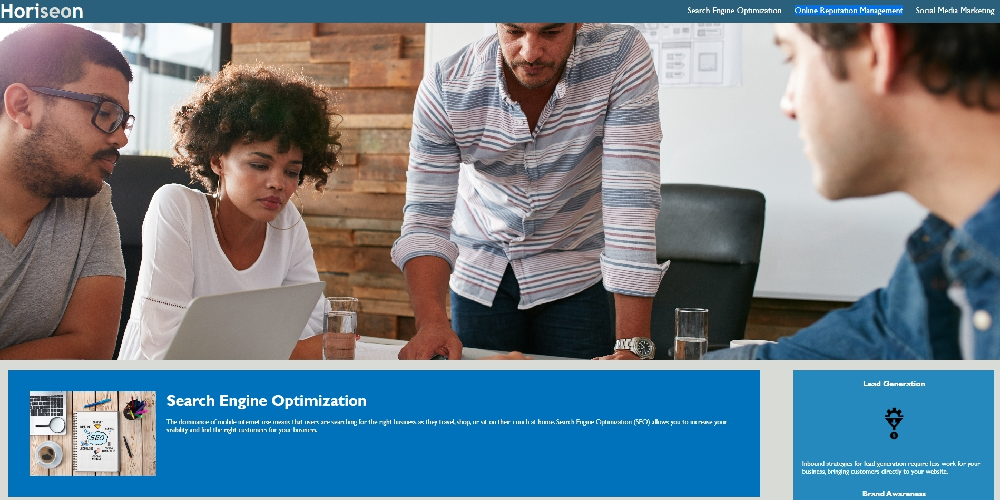
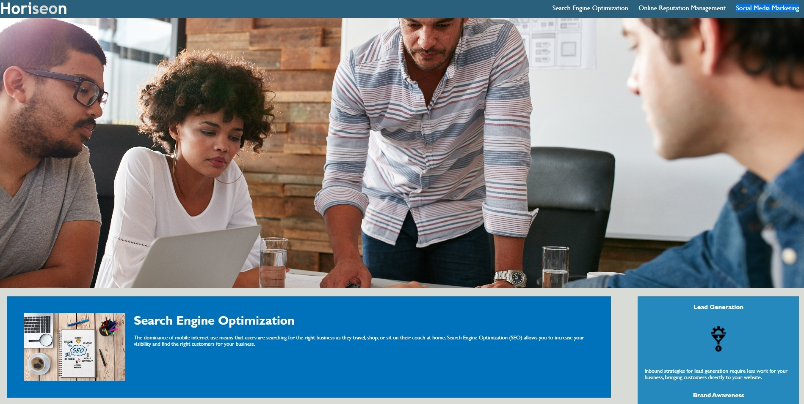

# <Horison-Clean-Up>

## Description

- What was your motivation?
Refractoring Horison's website and improving accessibility with HTML and CSS.

- Why did you build this project? (Note: the answer is not "Because it was a homework assignment."
Built this project in order to refractor the existing website and improving accessibility, in order for their website to be more optimized for search engines.

- What problem does it solve?
Website meets accessibility standards by adding accessible alt attributes and making sure elements follow structure.

- What did you learn?
For the Horison's website clean up, I learned that that in the html code, there were many css selectors that were not working properly due to syntax errors.


## Installation

Please run the index.html file in order to view the website.
## Usage

Click on the following header options:
1. Search Engine Optimization
2. Online Reputation Management
3. Social Media Marketing

The action that proceeds will trigger your page to go directly to that respective section and its information.

Instructions and examples for use. Included are screenshots of highlighted options that you can click on to read the information.

    ```md
    
    
    
    ```

## License

---MIT License


## Features

- There are three main feature in which you can click on Search Engine Optimization, Online Reputation Management, and Social Media Marketing in the Header. 
  By doing so, the following action will take you down to the respective section of the page.


## Tests

Run index.html and click through the three options in the header. Clicking on the respective subject will take you down to it's section in the page. 